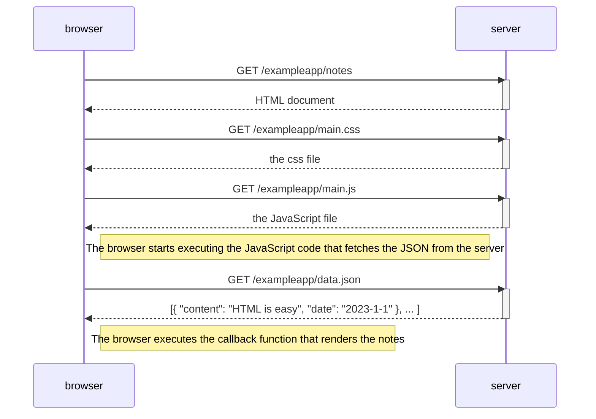
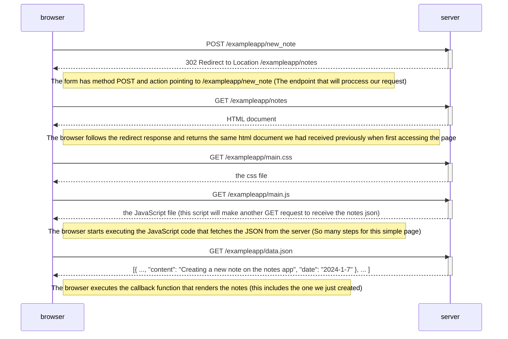

# Exercize 0.4

## Create a similar diagram depicting the situation where the user creates a new note on the page https://studies.cs.helsinki.fi/exampleapp/notes by writing something into the text field and clicking the Save button.

### Example

Let's say I'll type `Creating a new note on the notes app` into the input field and press the Save button, the sequence is not all that different from the one in the example, the difference being the browser executes an extra HTTP request, the POST, and receives a response with status 302 pointing to the Location `/exampleapp/notes`, the browser then automatically makes a GET request to that endpoint and the page reloads. It would be much better if the POST response included the created note instead of a redirect, but since this is an example on what NOT to do I undestand.

The updated diagram including the note I created looks kind of like this:

