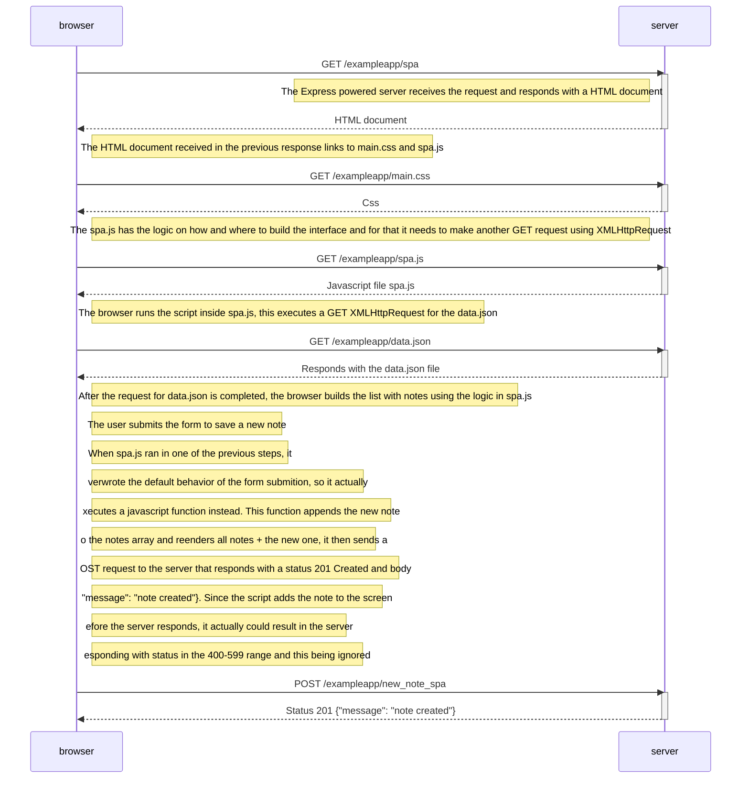

# Exercize 0-6

### Create a diagram depicting the situation where the user creates a new note using the single-page version of the app.

#### Answer

When the user submits the form using the spa version it instead of reloading the page, like the previous version, it actually prevents the default behavior of the form and instead it adds the new note to the current state of the page, redraws all notes using a function from spa.js and then it makes the POST request to the server at the endpoint /exampleapp/new_note_spa to save the new note

